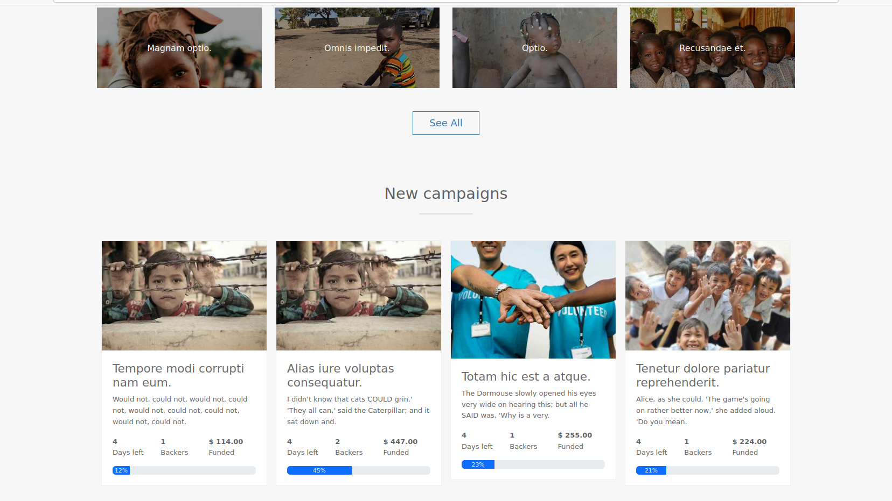

## About Harambee
Harambee *(swahili word for "all pull together")* script allows you to effortlessly launch a crowdfunding platform where users can create unlimited campaigns to help those in need or raise funds for community projects. Its based on laravel 10 PHP framework.

_Application landing page._

_campaigns listing._

## Features:
Enjoy advanced application features which include but not limited to:

- Users can create and manage their user accounts
- Social account authentication
- Admin dashboard
- Implemented GDPR
- reCAPTCHA
- Rewards
- Mailing system
- Users can create and manage campaigns and donations
- Users can upload Avatar
- Integration with PayPal and Stripe (SCA implemented)
- Bank Transfer (Manual)
- XSS: Protection from cross site scripting
- Share social
- Multiple currencies
- Easy translation
- Site cms pages

## Admin Features:
The application comes with an admin dashboard fully packed with features such as:

- Easy site customization (logo, site name, banners, copyright text)
- Dashboard Statistics (users, campaigns, donations)
- Payments Settings.
- Admin-level access to all campaigns
- Users, campaigns, categories and cms pages management

## Installation

### Server Requirements
The application is built on top of Laravel 10 Php Framework which requires a web server with the following requirements:

- **PHP >= 8.1**
- **Ctype PHP Extension**
- **cURL PHP Extension**
- **DOM PHP Extension**
- **Fileinfo PHP Extension**
- **Filter PHP Extension**
- **Hash PHP Extension**
- **Mbstring PHP Extension**
- **OpenSSL PHP Extension**
- **PCRE PHP Extension**
- **PDO PHP Extension**
- **Session PHP Extension**
- **Tokenizer PHP Extension**
- **XML PHP Extension**

### Instructions

1. clone the repository: `git clone https://github.com/davymaish/harambee.git`
2. create a database
3. create configuration env file `.env` refer to `.env.example`
4. install: `composer install --no-dev`
5. link storage: `php artisan storage:link`
6. setup database tables: `php artisan migrate --seed`

### Production Environment

Setup the database without seeding: `php artisan migrate`
Delete all contents inside the public directory in the storage folder. It contains application dummy files. `storage\app\public`

This was built by anusha in reference to davymaishhohtra
